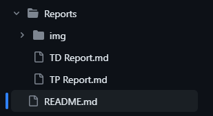

# Ethical-Hacking

Welcome to this repository which compiles two reports on the Ethical Hacking subject I studied during my first year at IMT Mines Alès.

The first report details the resolution of the 5 practical works (TP) available at this link: https://github.com/nicosmash/Universities/blob/main/Labs/VirtualLab_What_to_do.md

The second report covers the resolution of 5 tutorial exercises (TD) on tryhackme, which can be found at this link: https://github.com/nicosmash/Universities/blob/main/IMT_Ales_Promo_1.md

It's important to note that the TP report was completed before the TD report. Hence, I didn't utilize all the tools presented in the TD initially; I incorporated them later for some tasks. Nevertheless, this allowed me to enhance my skills and explore additional tools independently.

Thank you for taking the time to read this presentation. Enjoy your reading!
