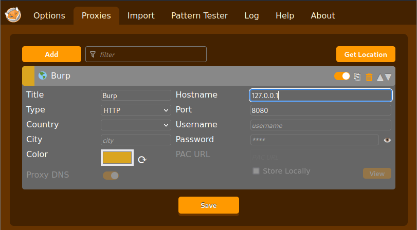
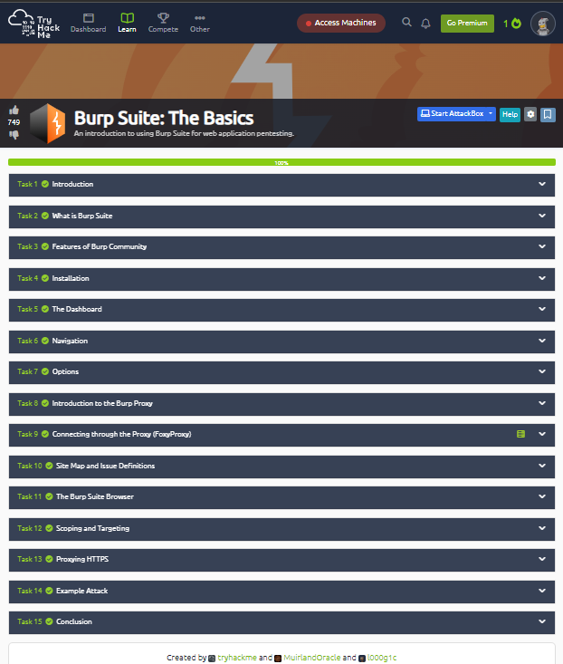
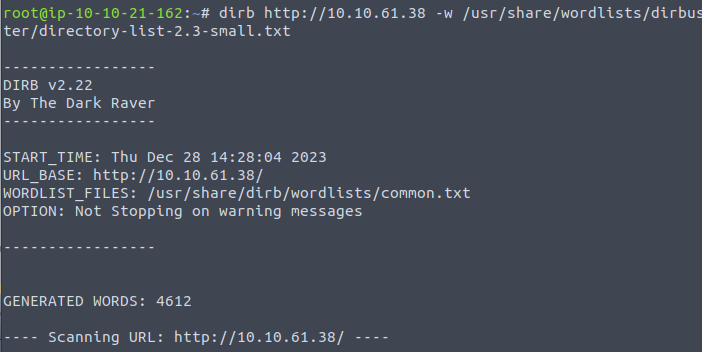
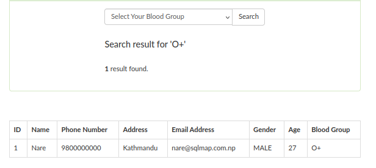
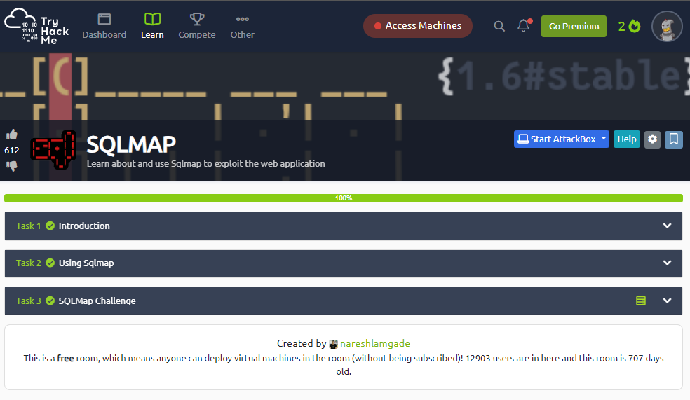
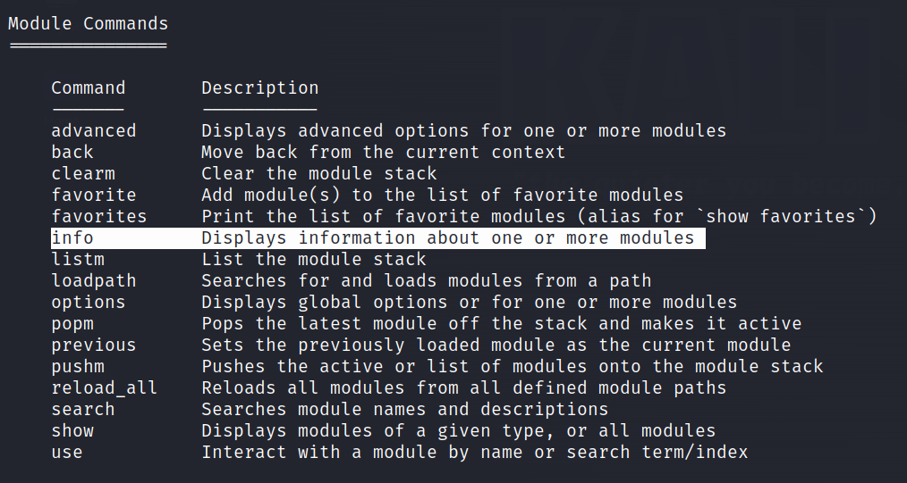
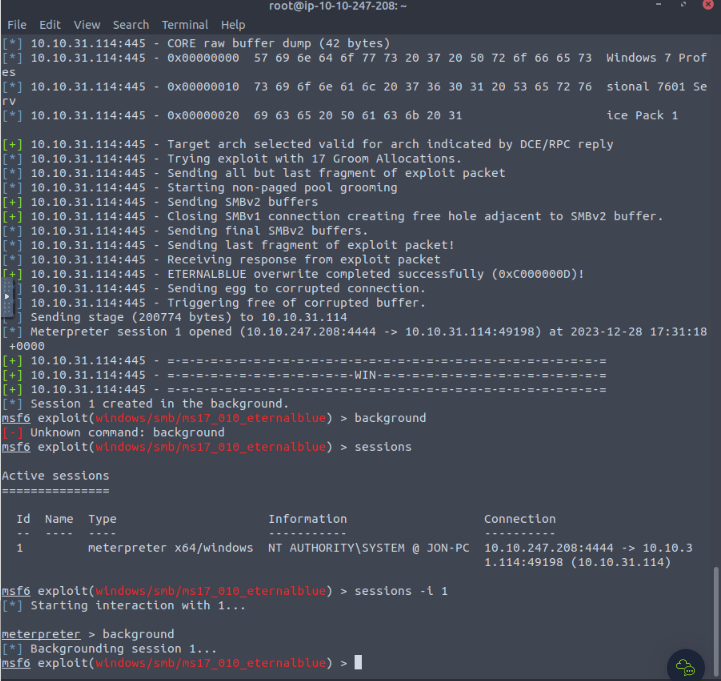
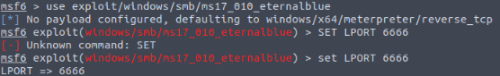

# **Report**

**Subject Link** : https://github.com/nicosmash/Universities/blob/main/IMT_Ales_Promo_1.md

<br>

# **Table of Contents**
*Click on the selected **TD** to see my work.*

1. [Nmap](#nmap)

2. [Burp](#burp)
   
3. [SQLMap](#sqlmap)
 
4. [Metasploit](#metasploit)

<br>
<br>
<br>

# Nmap

**Link :** https://tryhackme.com/room/furthernmap

## Introduction

```
Nmap, short for Network Mapper, is an open-source network scanning tool used for discovering hosts and services on a computer network, creating a map of the network topology. It employs various scanning techniques, including port scanning, service version detection, and OS fingerprinting, to provide a comprehensive view of the network. Nmap is known for its flexibility, allowing users to adapt scans based on specific needs. It is widely utilized by security professionals and network administrators to identify open ports, services running on those ports, and potential vulnerabilities. Nmap's scripting engine (NSE) enables the execution of custom scripts for more advanced network exploration. Nmap is an essential tool for network reconnaissance, security auditing, and troubleshooting.
```

* What networking constructs are used to direct traffic to the right application on a server? "**Ports**"

* How many of these are available on any network-enabled computer? "**65535**"

* [Research] How many of these are considered "well-known"? (These are the "standard" numbers mentioned in the task) "**1024**"


## Nmap switches
Nmap is a command-line penetration testing tool. Available on Windows and Linux, we'll assume usage under Linux. It's installed by default in Kali Linux and the TryHackMe Attack Box.

Some important switches:

* Syn Scan: -sS
* UDP Scan: -sU
* OS detection: -O
* Service version detection: -sV
* Increase verbosity: -v (level 1), -vv (level 2)
* Save results in three major formats: -oA
* Save in "normal" format: -oN
* Save in "grepable" format: -oG
* Enable "aggressive" mode: -A
* Set "timing" template to level 5: -T5
* Scan only port 80: -p 80
* Scan ports 1000-1500: -p 1000-1500
* Scan all ports: -p-
* Enable a script from the library: --script
* Enable all scripts in the "vuln" category: --script=vuln

Result for **"nmap -h"** :


## Overview
When scanning ports with Nmap, there are three basic types of scans. These are:

* TCP Connect Scan (-sT)
* SYN "Half-open" Scan (-sS)
* UDP Scan (-sU)


 

Additionally, there are several less common port scanning types.

These are:

* TCP Null Scan (-sN)
* TCP FIN Scan (-sF)
* TCP Xmas Scan (-sX)


Most of these scans (except UDP scans) are used for very similar purposes. However, how they operate differs between each scan. This means that while one of the first three scans is likely your preferred choice in most situations, it's worth noting that other scanning types exist.

## TCP Connect Scans
To understand TCP Connect scans (-sT), it's important to be familiar with the "TCP three-way handshake" procedure.

It occurs in three steps:

* Sending a TCP request with the SYN flag by the connecting terminal
* Server response with a TCP packet containing the SYN and ACK flags
* Terminal completes the procedure by sending a TCP request with the ACK flag.

In Nmap's TCP Connect scans, the "TCP three-way handshake" is performed with each target port. Nmap attempts to connect to each specified TCP port and determines if the service is open based on the received response.

If a port is closed, the server sends a TCP packet with the RST flag to indicate this, following RFC 9293. https://datatracker.ietf.org/doc/html/rfc9293

If the port is open, the server responds with a TCP packet with the SYN/ACK flags, and Nmap marks the port as open.

## SYN Scans
SYN scans (-sS) are used to analyze the TCP port range of a target or multiple targets, but they operate slightly differently than TCP scans.

Unlike TCP scans that perform a "TCP three-way handshake," SYN scans return a TCP RST packet after receiving a SYN/ACK from the server, avoiding a repeated attempt from the server.

SYN scans are the default scans used by Nmap with sudo permissions; without these permissions, Nmap defaults to TCP Connect scans.

## UDP Scans
UDP connections are stateless, unlike TCP connections, meaning they don't require a handshake and are based on sending packets without confirmation.

The command for a UDP scan with Nmap is (-sU).

When a packet is sent to an open UDP port, there should be no response, and Nmap marks the port as open|filtered, suggesting it might be protected by a firewall.

If a UDP response is received (which is rare), the port is marked as open.

In the absence of a response, Nmap sends a second request as a double-check. If no response is received, the port is marked as open|filtered.

Due to the difficulty in determining if a UDP port is open, UDP scans are generally slow compared to TCP scans, hence the recommendation to use the --top-ports option to limit the number of scanned ports.


## NULL, FIN and Xmas
NULL, FIN, and Xmas scans are less commonly used than other scan types like SYN.

NULL scans (-sN) send a TCP request with no flags. According to the RFC, the server should respond with an RST if the port is closed.


FIN scans (-sF) work similarly but send a request with the FIN flag. An RST is also expected if the port is closed.


Xmas scans (-sX) send a malformed TCP packet with the PSH, URG, and FIN flags, resembling a Christmas tree flashing in Wireshark.


The expected response for open ports is similar to a UDP scan: no response to the malformed packet.

These scans identify ports as open|filtered, closed, or filtered. If filtered, it may indicate an ICMP response from the server.

The primary goal is firewall evasion, as many are configured to block TCP packets with the SYN flag.
However, modern IDSs are often aware of these scan types, so they are not always 100% effective with modern systems.

## ICMP Network Scanning

The command for the ping sweep is executed with the -sn option, excluding port scans and relying mainly on ICMP echo packets. Two IP address formats are possible, either with a hyphen (192.168.0.1-254) or using CIDR notation (192.168.0.0/24). 

Example of the nmap command which performs ping sweep on network 172.16.x.x (Netmask: 255.255.0.0) :


(CIDR notation : 172.16.0.0/16)

## NSE Scripts
The Nmap Scripting Engine (NSE) is an incredibly powerful addition to Nmap, significantly expanding its functionality. NSE scripts are written in the Lua programming language.

There are many categories available here : https://nmap.org/book/nse-usage.html 

To run a specific script, we would use --script=script-name.


Nmap scripts come with built-in help menus, which can be accessed using nmap --script-help script-name .


https://nmap.org/nsedoc/scripts/ftp-anon.html

 Nmap stores its scripts on Linux at /usr/share/nmap/scripts.

* What is the filename of the script which determines the underlying OS of the SMB server?


* Read through this script. What does it depend on?


## Firewall Evasion

Nmap will always treat the target host(s) as being alive, effectively bypassing the **ICMP** block with an option: **-Pn**

* Which Nmap switch allows you to append an arbitrary length of random data to the end of packets? "**--data-length**"


## Practical

* Does the target (MACHINE_IP) respond to ICMP (ping) requests (Y/N)? "**N**"

* Perform an Xmas scan on the first 999 ports of the target -- how many ports are shown to be open or filtered? "**999**"


* Perform a TCP SYN scan on the first 5000 ports of the target -- how many ports are shown to be open? "**5**"


* Deploy the ftp-anon script against the box. Can Nmap login successfully to the FTP server on port 21? (Y/N) "**Y**"


<br>
<br>
<br>

# Burp

**Link :** https://tryhackme.com/room/burpsuitebasics

## What is Burp Suite ?
```
Burp Suite is a leading web application security testing tool used for assessing and securing web applications. It offers a comprehensive set of features for manual and automated testing. Burp Suite includes a proxy, scanner, and various other tools to identify and address security vulnerabilities. Its graphical interface to intercept and modify HTTP/S traffic, analyze requests and responses, and identify potential weaknesses like cross-site scripting (XSS) and SQL injection. The tool's scanning capabilities automate the detection of vulnerabilities, while its advanced features support in-depth manual testing. Burp Suite is widely adopted for both educational purposes and professional security assessments, playing a crucial role in ensuring the robustness of web applications.
```

Burp Suite is available in different editions. 

Burp Suite Community Edition, which is freely accessible for non-commercial use within legal boundaries.

Burp Suite Professional is an unrestricted version of Burp Suite Community.

Burp Suite Enterprise, in contrast to the community and professional editions, is primarily utilized for continuous scanning.

* Which edition of Burp Suite runs on a server and provides constant scanning for target web apps? "**Burp Suite Enterprise**"

* Burp Suite is frequently used when attacking web applications and ______ applications. "**mobile**"

## Features of Burp Community

Some of the key features :
- **Proxy** enables interception and modification of requests and responses while interacting with web applications.
- **Repeater** allows for capturing, modifying, and resending the same request multiple times.
- **Intruder**  allows for spraying endpoints with requests.
- **Decoder** offers a valuable service for data transformation.
- **Comparer** enables the comparison of two pieces of data at either the word or byte level.
- **Sequencer** is typically employed when assessing the randomness of tokens.

<br>

* Which Burp Suite feature allows us to intercept requests between ourselves and the target? "**Proxy**"

* Which Burp tool would we use to brute-force a login form? "**Intruder**"

## Installation

"**sudo apt install burpsuite**"


## The Dashboard

The **Tasks** menu allows you to define background tasks that Burp Suite will perform while you use the application.

The **Event log** provides information about the actions performed by Burp Suite.

**Issue Activity** section displays the vulnerabilities identified by the automated scanner.

The **Advisory** section provides more detailed information about the identified vulnerabilities, including references and suggested remediations. 


* What menu provides information about the actions performed by Burp Suite, such as starting the proxy, and details about connections made through Burp? "**Event log**"

## Navigation

In Burp Suite, the default navigation is primarily done through the top menu bars, which allow you to switch between modules and access various sub-tabs within each module.

Keyboard **shortcuts** :
1. Ctrl + Shift + D : **Dashboard**
2. Ctrl + Shift + T : **Target tab**
3. Ctrl + Shift + P : **Proxy tab**
4. Ctrl + Shift + I : **Intruder tab**
5. Ctrl + Shift + R : **Repeater tab**

<br>

* Which tab Ctrl + Shift + P will switch us to? "**Proxy tab**"


## Options

There are two types of settings: **Global settings** and **Project settings**.


* In which category can you find a reference to a "Cookie jar"? "**Sessions**"


* In which base category can you find the "Updates" sub-category, which controls the Burp Suite update behaviour? "**Suite**"


* What is the name of the sub-category which allows you to change the keybindings for shortcuts in Burp Suite? "**Hotkeys**"


* If we have uploaded Client-Side TLS certificates, can we override these on a per-project basis (yea/nay)? "**yea**"

## Introduction to the Burp Proxy

The Burp Proxy enables the capture of requests and responses between the user and the target web server.

Key Points about the Burp Proxy :

- Intercepting Requests


- Taking Control

- Capture and Logging

- WebSocket Support

- Logs and History


Two notable features in the Proxy Settings :
- Response Interception
- Match and Replace

## Connecting through the Proxy (FoxyProxy)

Download and install the FoxyProxy Basic extension :
https://addons.mozilla.org/en-US/firefox/addon/foxyproxy-basic/

Protocol for connecting through the proxy :

**Step 1 :** 


**Step 2 :**


**Step 3 :**


**Step 4 :**


**Step 5 :**



**Step 6 :**


**Step 7 :**


## Site Map and Issue Definitions

The Target tab in Burp Suite provides more than just control over the scope of our testing. It consists of three sub-tabs:
- Site map
- Issue definitions
- Scope settings

<br>

* What is the flag you receive after visiting the unusual endpoint? "**THM{NmNlZTliNGE1MWU1ZTQzMzgzNmFiNWVk}**"

## The Burp Suite Browser

In addition to modifying our regular web browser to work with the proxy, Burp Suite also includes a built-in Chromium browser that is pre-configured to use the proxy without any of the modifications we just had to do.

As I've encountered an error preventing the Burp Browser from starting up due to the impossibility of creating a sandbox environment.


## Scoping and Targeting

The Scope settings window allows us to control our target scope by including or excluding domains/IPs. This section is powerful and worth spending time getting familiar with.


## Proxying HTTPS

When intercepting HTTP traffic, I encounter a problem when browsing to sites where the TLS protocol is enabled.

To solve this problem, I manually added the certificate of the PortSwigger certification authority to the list of trusted certification authorities in our browser.

-> http://burp/cert


## Example attack

The example demonstrates a successful Cross-Site Scripting (XSS) attack on a web application by bypassing a client-side filter using Burp Proxy and a simple payload, leading to the execution of a script on the targeted website.

**Step 1 :**


**Step 2 :**


```
<script>alert("Succ3ssful XSS")</script>
```

**Step 3 :**


**Step 4 :**


<br>
<br>



<br>
<br>
<br>

# SQLMap

**Link :** https://tryhackme.com/room/sqlmap

## Introduction

```
SQLmap is an open-source penetration testing tool designed to automate the detection and exploitation of SQL injection vulnerabilities in database-driven applications. It provides a command-line interface for security professionals and ethical hackers to identify and exploit SQL injection flaws. The tool automates the process of fingerprinting the database, extracting data, and even escalating privileges on compromised systems. SQLmap's versatility makes it a valuable asset in security assessments and ethical hacking exercises, aiding in the identification and remediation of SQL injection vulnerabilities. 
```


## Using SQLMap

Help menu : 
```
sqlmap -h
```

Extensive list of options :
```
sqlmap -hh
```


* Which flag or option will allow you to add a URL to the command? "**-u**"


* Which flag would you use to add data to a POST request? "**--data**"


* There are two parameters: username and password. How would you tell sqlmap to use the username parameter for the attack? "**-p username**"


* Which flag would you use to show the advanced help menu? "**-hh**"


* Which flag allows you to retrieve everything? "**-a**"


* Which flag allows you to select the database name? "**-D**"


* Which flag would you use to retrieve database tables? "**--tables**"


* Which flag allows you to retrieve a table’s columns? "**--columns**"


* Which flag allows you to dump all the database table entries? "**--dump-all**"


* Which flag will give you an interactive SQL Shell prompt? "**--sql-shell**"


* You know the current db type is 'MYSQL'. Which flag allows you to enumerate only MySQL databases? "**--dbms=mysql**"


## SQLMap Challenge

I start by going to the attackbox ip.


As I don't have access to any web pages other than index.html, I'd like to explore the files on this website. I decide to use dirb as I had the opportunity to use it during the practical sessions.


I can't find anything despite using different wordlists. I'm trying to search on lists from the "dirbuster" folder but it doesn't work, the wordlist is not taken into account by dirb. 



After a lot of research, I looked at the tip on tryhackme which told me to use gobuster. So I use it, specifying that I'd like folders, hence the use of dir, I specify the url and I put one of the wordlists in the dirbuster folder. The wordlist is taken into account by gobuster and it works, I find the "blood" folder. 

* What is the name of the interesting directory ? "**blood**"


I browse the web page and try out all the suggestions in the drop-down list. All of them give me a "nothing found" except group O+.




I decide to intercept the request when I search for the O+ group using the "Burp" tool.


I copy this into a "request" file so that I can use it with sqlmap.


So I decided to run the command "sqlmap -r Desktop/request -p blood-group --current-user". The -r parameter allows me to specify the query used, and -p the variable I'm using and, as I'm looking for the current db user, I add --current-user.


This is where I realised that the user was root. You can see it on the line "current user: 'root@localhost'".

* Who is the current db user? "**root**"


Since I realised that the blood_group parameter is vulnerable, I decided to exploit it by trying to discover existing databases. Hence the addition of "--dbs".


So I decide to display all the data and I come across the flag!

* What is the final flag? "**thm{sqlm@p_is_L0ve}**"


<br>
<br>



<br>
<br>
<br>

# Metasploit

**Link :** https://tryhackme.com/room/metasploitintro

## Introduction
```
Metasploit is an open-source penetration testing framework widely employed to assess the security of computer systems. It provides a modular platform for developing, testing, and executing exploits against specific vulnerabilities. With an extensive library of exploits, shells, payloads, and tools, users can create complex penetration testing scenarios using existing modules or by developing their own. Supporting various protocols and services, it simulates attacks on diverse systems, including networks, web applications, and servers. Metasploit is utilized for educational, security research, and security auditing purposes to identify and address vulnerabilities.
```

The three main components of the Metasploit Framework :
* msfconsole
* Modules
* Tools

## Main Components

Few recurring concepts:
* **Exploit**: A piece of code that uses a vulnerability present on the target system.
* **Vulnerability**: A design, coding, or logic flaw affecting the target system.
* **Payload**: An exploit will take advantage of a vulnerability. 


-> Four different directories under **payloads**: adapters, singles, stagers and stages.

* What is the name of the code taking advantage of a flaw on the target system? "**Exploit**"

* What is the name of the code that runs on the target system to achieve the attacker's goal? "**Payload**"

* What are self-contained payloads called? "**Singles**"

*Singles: Self-contained payloads (add user, launch notepad.exe, etc.) that do not need to download an additional component to run.*

* Is "windows/x64/pingback_reverse_tcp" among singles or staged payload? "**singles**"


In the path of the soruce code we find "singles". But also, windows/x64/pingback_reverse_tcp doesn't need to download an additional component to run.

## Msfconsole


* How would you search for a module related to Apache? "**search apache**"

**Step 1 :**


**Step 2 :**


* Who provided the auxiliary/scanner/ssh/ssh_login module? "**todb**"

**Step 1 :**



**Step 2 :**


**Step 3 :**


## Working with modules

I decided to follow and redo the example shown in this section, and here's how I did it :





* How would you set the LPORT value to 6666? "**set LPORT 6666**"

All parameters are set using the same command syntax:
```
set PARAMETER_NAME VALUE
```
Looking at the example in the tryhackme course, I used the "set LPORT 6666" command. 

-> LPORT: "Local port", the port you will use for the reverse shell to connect back to.




* How would you set the global value for RHOSTS  to 10.10.19.23 ? "**SETG RHOSTS 10.10.19.23**"


-> The setg command allows you to set the value so it can be used by default across different modules.

-> RHOSTS : "Remote Hosts", , the IP address of the target system.

* What command would you use to clear a set payload? "**unset payload**"

I can also clear any parameter value using the unset command.


* What command do you use to proceed with the exploitation phase? "**Exploit**"

Once all module parameters are set, you can launch the module using the exploit command.

<br>
<br>

