# **Report**

In the rapidly evolving landscape of cybersecurity, ethical hacking has become a crucial component in identifying and mitigating vulnerabilities within computer systems. This report delves into five distinct hands-on practical sessions (TP) conducted on five separate virtual machines. Each session focuses on a aspect of ethical hacking, providing a comprehensive overview of techniques and tools employed to assess and secure computer systems.

**Subject Link** : https://github.com/nicosmash/Universities/blob/main/Labs/VirtualLab_What_to_do.md 

 

# **Table of Contents**
*Click on the selected **TP** to see my work.*

## [I. **TP1** : RICKDICULOUSLYEASY](#i-tp1--rickdiculouslyeasy-1)
   - [**A. Overview**](#a-overview)
   - [**B. Methodology**](#b-methodology)
   - [**C. Tools Discovered**](#c-tools-discovered)

## [II. **TP2** : VULNCMS](#ii-tp2--vulncms-1)
   - [**A. Overview**](#a-overview-1)
   - [**B. Methodology**](#b-methodology-1)
   - [**C. Tools Discovered**](#c-tools-discovered-1)

## [III. **TP3** : BASIC PENTESTING](#iii-tp3--basic-pentesting-1)
   - [**A. Overview**](#a-overview-2)
   - [**B. Methodology**](#b-methodology-2)
   - [**C. Tools Discovered**](#c-tools-discovered-2)

## [IV. **TP4** : PENTESTER LAB: FROM SQL INJECTION TO SHELL](#iv-tp4--pentester-lab-from-sql-injection-to-shell-1)
   - [**A. Overview**](#a-overview-3)
   - [**B. Methodology**](#b-methodology-3)
   - [**C. Tools Discovered**](#c-tools-discovered-3)

## [V. **TP5** : FUNBOX: CTF](#v-tp5--funbox-ctf-1)
   - [**A. Overview**](#a-overview-4)
   - [**B. Methodology**](#b-methodology-4)
   - [**C. Tools Discovered**](#c-tools-discovered-4)

## [VI. Conclusion](#vi-conclusion-1)
   - [**A. Lessons Learned**](#a-lessons-learned)
   - [**B. Bibliography**](#b-bibliography)

 
 
 

# I. **TP1** : RICKDICULOUSLYEASY

### Link : https://www.vulnhub.com/entry/rickdiculouslyeasy-1,207/

## A. Overview

Let's start with TP1 of our ethical hacking series. In this session, our objective is to discover eight vulnerabilities flagged with "FLAG{" on the Fedora server VM "RICKDICULOUSLYEASY." This beginner VM, themed around Rick and Morty, provides a straightforward introduction to penetration testing.

RICKDICULOUSLYEASY is a Fedora Server crafted for beginners, presenting a simple boot-to-root challenge with a total of 130 points associated with flagged vulnerabilities. The goal is to identify these vulnerabilities, earn points for each flagged discovery, and ultimately achieve root access. To participate, follow the provided link and accumulate points by identifying vulnerabilities flagged with "FLAG{" while progressing toward obtaining root access.

This session serves to introduce us to the practical aspects of ethical hacking, emphasizing the importance of reconnaissance in identifying vulnerabilities. As I navigate through the Rick and Morty-themed world of RICKDICULOUSLYEASY, my aim is to accumulate points by uncovering these flagged vulnerabilities, ultimately progressing toward gaining root access.

## B. Methodology

Once the VM has been downloaded and launched, you arrive on this page. So you can already see the links for the admin console.

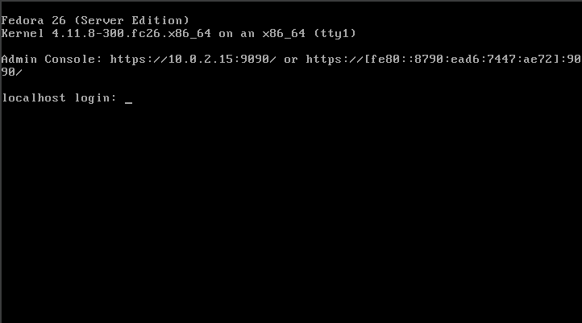

On this first page, you'll find the first flag {THE IS NO ZEUS, IN YOUR FACE!} which earns me 10 points.

I'm now looking for commands that might be useful with what I have, i.e. only the 10.0.2.15 address. So I'm thinking of **"nmap"**. It is an open source network discovery tool that allows you to explore and analyse hosts, services and vulnerabilities on a computer network.

However, there are several parameters you can set for nmap, so I chose to test **-sV** first, as it seemed the most appropriate. This allows you to test open ports to determine which service is listening and its version.

I couldn't get anything out of it so I added another parameter which is **"-Pn"** which considers all hosts to be connected.

In order to scan all the ports, I added the **"-p-"** parameter, which showed me that I could have two ssh ports on which I could try to connect using ssh, one of which is "ssh?", which is not necessarily ssh.

I also see two ports where I don't have the service, so I'm going to try to **netcat** them. Netcat, creates a network connection between two systems using a user-specified IP address and port number.

On port 60000, I found a flag: {Flip the pickle Morty!} which gets me 10 points.

On port 13337, I found a flag: {TheyFoundMyBackDoorMorty!} which gets me 10 points.

I see that there's a Linux distribution, Ubuntu, installed on this port, so I need to see if there's a way of accessing it, so I decide to do an nmap -A. The -A option performs a complete analysis of the target system, trying to determine the operating system, the services running on the open ports, the versions of the services, and it executes certain default scripts to obtain more information about the security of the system.

I then see that a user with the login "anonymous" ftp is authorised, and I decide to try to access this address via FTP (File Transfer Protocol), which involves trying to connect to an FTP server at this address.

As a result, when I attempted to log in, I was presented with a "password" prompt. Opting to leave it blank, I discovered that this approach worked, and I was successfully logged in as anonymous. My initial instinct was to execute an 'ls' command to inspect the files on the server. While doing so, I identified a "FLAG.txt" file and attempted to display its contents using the 'cat' command, only to realize that it was not available. In an attempt to modify permissions for the "FLAG.txt" file, I encountered a roadblock since the anonymous user lacked root privileges.

Undeterred, I explored an alternative method to retrieve a file from an FTP connection, using the 'get "filename"' command. 

After obtaining the file, I returned to my Kali machine to examine the "FLAG.txt" file. On my local machine, I successfully used the 'cat' command and uncovered the flag: {Whoa, this is unexpected}, earning me **10 points**.

Now I'm trying to find other flags, because at the moment I've only got 4, so I'm halfway to my final goal. After several attempts and explorations of the system, I realise that I haven't explored the website enough and I'm looking for where I can find more security flaws and that's when I come across this message from **ChatGPT**.

So I decided to try it out.

However, I noticed that from the beginning, I've been searching for the address with "https" and including the port. So, I decide to remove the port and switch to the less secure "http" protocol. I think that by using this protocol, I might be able to find more information. Initially, I come across a Rick and Morty page that doesn't provide any useful information. However, I decide to follow ChatGPT's advice, and there I discover three file paths.

I am exploring the pages while considering inspecting the element to see if I find things in the HTML code that have been commented. The first page, root_shell.cgi, doesn't provide me with anything.

I am trying to go to the next page, which is tracertool.cgi. This one is an IP tracer, however, I notice that there is a textarea, so I think it might be possible to inject code into it. However, for now, I am just inspecting the options available to me with these pages.

So, I explore the last route I found with  robots.txt, which is /cgi-bin/, but I see that I don't have the rights to access it.

I wanted to continue scanning the pages to see if I could uncover anything that would allow me to exploit the previously discovered pages. While exploring the tools available in Kali Linux for retrieving information from a website, I came across dirb. Dirb is a tool that helps identify all available routes on a website. In fact, DIRB is a Web Content Scanner designed to locate existing (and/or hidden) web objects. Its functionality involves launching a dictionary-based attack against a web server and analyzing the responses.

It was at this moment that I realized there was a folder I had not yet explored: passwords. In this folder there were two elements: FLAG.txt and passwords.html.

FLAG.txt is a new flag which is {Yeah d- just don’t do it. }. This one makes me gain 10 points.

Then, I decide to discover the passwords.html file which seems to be just an html page with text. However, when I open the inspector I notice that a password is left in comment:  **winter**.

Finally, I decided to revisit the tracertool.cgi page that I had left suspended in case I could discover any potential exploits across its various pages. However, since I didn't find anything, I decided to test some code injections. Here, you can observe that I'm attempting to display an alert in JavaScript. Unfortunately, it isn't working.

Since it functions similarly to the traceroute function, I assumed that special characters might work. I initially tried using "|," but it yielded no results. I continued experimenting until I found the ";" character, which finally produced a result. It was at this point that I realized I could execute commands after this particular character.

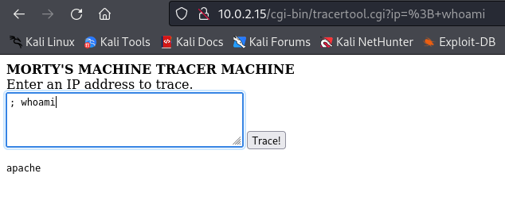

So I decide to explore the files in this directory and return to the parent directories.

 

I notice that I can navigate quite extensively through the folders, and by searching gradually, I come across a specific file, /etc/passwd, which holds the basic user attributes. Consequently, I attempt to use the "cat" command to display its contents, but the cat command has been disabled and it returns a chat instead.

So I realize that I need to use different commands to view the contents of a file. I initially thought of using 'vi,' which allows for file editing and, consequently, displays its contents. However, when viewing the file in the browser, the text gets cut off after a while. Therefore, I am searching for alternative commands.

So, I found the 'more' command, which allows me to display the file in its entirety. This enables me to realize that there are three users I have not yet explored: RickSanchez, Morty, and Summer.

Therefore, I decided to do an nmap again because I could not remember which ports were available to connect to these users.

I observe that I can connect via SSH on ports 22 and 22222. Therefore, I decide to test both with the username "Summer." I notice that port 22222 is functional, but I encounter a password prompt. Instinctively, I first try basic passwords like "Summer," "root," and "password." It is at this moment that I recall a password I had found in the HTML code of a web page, which was "winter," and it works. I am now connected as Summer.

Once again, my initial instinct is to inspect the contents of the directory I'm in, and I come across a file named FLAG.txt. I decide to use the "cat" command, but the command is still disabled. As an alternative, I use "more FLAG.txt" and uncover a new flag: {Get off the high road Summer!}, earning me 10 points.

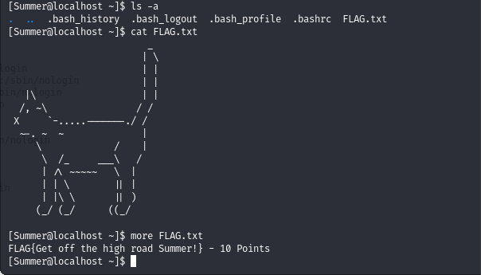

I navigate through the parent directories and come across three folders named after the three users previously found. Starting with Morty, I choose to display the img/TP1/image using "more" since I can't open it directly in the SSH terminal. It's at this point that I spot a new password: "Meeseek".

However, I'm unable to display the contents of the ".zip" file, so I seek information and learn how to copy a file from an SSH connection to my machine. Initially, I attempt to execute this command directly from my SSH connection, but I make a mistake. Later, I discover that I need to use "scp" from my machine. Subsequently, I successfully copy the file, "journal.txt.zip," to my home directory.

I decide to search and open the file with the interface.

However, when I attempt to open the file, I realize that it is secured with a password. Initially, I try "winter" since it is the last password I used. But, it doesn't work.

Again, I opt to enter various passwords that come to mind until I recall the password I found when I displayed the text from the img/TP1/image in the same initial directory as this file, which is "Meeseek."

This is where I find a new flag which is {131333}. This one makes me gain 20 points.

Next, I remember that there is a folder of a user that I have not explored yet: RickSanchez. So I decide to reproduce the same manipulation.

But, now it’s not a zip like the last file but an executable.

I am trying to launch it, but I can't because I'm missing a library, which I install. The library libmccrypt.so refers to the libmcrypt library, which is an open-source library dedicated to data encryption and hashing.

I am attempting to run this executable again, and now I am receiving a message indicating that a required argument is missing. Consequently, it seems that a password is missing.

Given that the returned message is "past rick to present Rick," one can consider the elements that have already occurred during this flag search. After trying several things, it becomes apparent that the last flag is 131333, and this password works.

So we find a new flag: {And Awwwaaaaayyyy we Go! } which gives me 20 more points.

Also with the help of three indications, it puts us on the road of the last objective: to have the rights of root. 

Following these indications, I google Rick’s old bands name and I keep only the word "Flesh" and the word "Curtains".

I am searching for a way to create two dictionaries with the two selected words, adding one uppercase letter and one digit. I am exploring various methods, and I come across the maskprocessor tool (https://www.kali.org/tools/maskprocessor/#mp64), which seems relatively simple to me. This is because I can input the arguments I want, using ?u for an uppercase letter and ?d for a digit, along with the previously selected words. And i have only to merge everything into a single file.

Then, in order to make the bruteforce attack to find the right password I found the **hydra** tool.

"Hydra is a parallelized login cracker which supports numerous protocols to attack. It is very fast and flexible, and new modules are easy to add." ( https://www.kali.org/tools/hydra/ )

I chose the -IVf, -l and -P parameters because by testing several times I realized that it was the most relevant in this case.
* -I : ignore an existing restore file (don't wait 10 seconds)
* -V : show login+pass for each attempt 
* -f : exit when a login/pass pair is found
* -l : It is to define the LOGIN name
* -P : It is the file with the dictionary

After finding the password, I reconnect to Summer and check RickSanchez's permissions. I notice that he has root privileges, so I decide to escalate to root.

After finding the password, I reconnect to Summer and check RickSanchez's permissions. I notice that he has root privileges, so I decide to escalate to root.

## C. Tools Discovered

* nmap : https://www.kali.org/tools/nmap/
* netcat : https://www.kali.org/tools/netcat/
* ftp and ftp get : https://www.sqlpac.com/fr/documents/unix-ftp-commandes.html
* dirb : https://www.kali.org/tools/dirb/
* scp : https://www.ionos.com/digitalguide/server/configuration/linux-scp-command/
* mp64 : https://www.kali.org/tools/maskprocessor/#mp64
* hydra : https://www.kali.org/tools/hydra/

 
 
 

# II. **TP2** : VULNCMS

### Link : https://www.vulnhub.com/entry/vulncms-1,710/

## A. Overview
Let's delve into TP2 of our ethical hacking series, featuring the intriguing challenge named VULNCMS. As the name implies, this box revolves around Content Management Systems (CMS). The objective is to meticulously enumerate the box, identify the underlying CMS, and exploit its vulnerabilities to gain root rights.

VULNCMS presents an immersive experience where participants are tasked with unraveling the mysteries of CMS vulnerabilities. In the spirit of ethical hacking, this session underscores the significance of reconnaissance, emphasizing its role in the identification of potential exploits.

Throughout this challenge, participants are encouraged to employ various exploit techniques and privilege escalation methods to progress from gaining access to ultimately achieving root privileges. As we navigate the CMS-centric landscape of VULNCMS, the journey involves unraveling intricacies, accumulating points, and ultimately mastering the art of ethical hacking.

The thematic focus on Reconnaissance, Exploit, and Privilege Escalation in VULNCMS aligns with the core aspects of ethical hacking, making this session a learning experience.

## B. Methodology

Upon arriving on the VM, I encountered an initial issue as I didn't have its IP. Consequently, while searching online, I discovered a method for identifying connected IPs within the same network : Netdiscover ( https://www.kali.org/tools/netdiscover/ ).

Once I've identified the corresponding ip, I decide to go directly to my web browser to mark the ip. That's when I came across a blog. I try to look at the source code to see if there are any flaws hidden in it, but I can't find anything.

I'm looking at the open ports again with nmap and the same options I put on the first tp as they proved very useful. However, I can't find anything very interesting to exploit right now.

Then I thought about the tool I'd discovered thanks to the first tutorial: "dirb". So I decide to use it and I see that there's the "robots.txt" file again.

I decided to look for it and discovered a new page: "about.html".

This page only shows me a discussion between Mobley and Elloit saying that bruteforce doesn't work all the time. So I'm guessing this capture the flag won't be solved with bruteforce attack. What's more, I can't find anything in the source code of the web page.

As I hadn't found anything this way, I'm looking into how I can exploit the nmap data as I thought I wouldn't find anything useful. But on looking again I see that the services on ports 80, 5000, 8081 and 9001 are http services and they're open. So I'm thinking maybe I can add them to my base url. In other words, I can test 10.0.2.5:PORT.

I've noticed that each time there's a different interface, so I'm thinking that maybe it's a different cms each time. So I decide to find out how to identify each CMS if they're different. Or maybe it's a different version of the same CMS each time. 

 

While searching on the internet, I came across this website: https://serpstat.com/blog/how-to-detect-which-cms-a-website-is-using-8-easy-ways/ . It tells me that you can find the name of the cms used in the meta tag in the source code of a website. So I test this and it works, I find the names of the CMS.

* 9001 : Drupal 7
* 8081 : Joomla
* 5000 : WordPress 5.7.2

However, the website on port 80 does not contain a meta tag containing the name of the CMS, so I conclude that it is not necessarily created from a CMS.

As the websites are different on each port, I try to use dirb again on a specific port and I see that there are many more files than on the website with port 80.

However, I find that I don't have access rights to these files. 

So I'm thinking, since I've managed to get the names of the cms on each page, that there may be vulnerabilities in the versions with which they've been installed. The vulnerabilities that might allow me to access all these files found using dirb.

Of the three CMS names I found, there are only two for which I have their version: Drupal **7** and WordPress **5.7.2**.

I decided to start looking for Drupal 7 and came across this article: https://www.getastra.com/blog/cms/drupal-vulnerability-5-most-critical-vulnerabilities-ever-found-on-drupal/ .

I'm going to test the first vulnerability and found the GitHub repository that lets you use it: https://github.com/dreadlocked/Drupalgeddon2.

Once I've cloned the project and read the README file, I try to launch the "drupalgeddon2.rb" file. I get the first error.

But this error is notified in the README so I just have to do a sudo gem install highline as it says:
"Whenever getting a cannot load such file "LoadError" type of error, do run sudo gem install "missing dependency". In particular, you may need to install the highline dependency with sudo gem install highline".

I manage to run the program only to see a few errors, so I try to install all the libraries required in the program but nothing changes. 

While I am in "drupalgeddon2>>", I decide to identify the user I'm logged in as. Out of habit, I run an 'ls' command to see the files I have access to.

At first glance, I don't see any alarming files as they appear to be similar to the directory structure of Drupal 7's core folders, as seen in this link: https://akabia.fr/drupal-7-d%C3%A9veloppement-de-modules .

As I saw on the last link that database credentials could be found in these files, I decided to explore them. I even ended up in a file where the database password is stored. However, for now, I'm unable to exploit it. I'm trying MySQL commands, checking if MySQL is installed correctly, etc. But, I can't find a way to access this data. I don't get discouraged and keep searching in other folders. I go through each one until I come across a peculiar file in the "misc" folder. A file named with a ".pass" extension.

I find a username and a password. Now I need to try connecting with it. I immediately think of connecting via SSH, as we did in the last TP for each user.

I successfully logged in; the password worked. Now, I decide to run 'sudo -l,' which allows a user to list the sudo privileges granted to them.

The output of the "sudo -l" command indicates that the user "tyrell" has specific permission to run the command '/bin/journalctl' as a root without the need to provide a password. This means that "tyrell" has limited privilege escalation on the 'journalctl' command, allowing them to execute this command with root rights without additional authentication.

I first thought that journalctl was a file that could be displayed via a cat, but no, it's when it's run that it's displayed. Consequently, I started reading the logs, but didn't find much of interest. 

So I decided to search the internet to see if anyone could explain to me what this file is and if there are any vulnerabilities when you have root privilege.

After a lot of research, I remember that this capture the flag contained the tag "privilege escalation". Consequently, I thought maybe if I wrote down the command I had and these words I'd have a solution and so I did, I found a vulnerability! 

-> https://gtfobins.github.io/gtfobins/journalctl/

I just need to add "!/bin/sh" to the end of my journalctl to have root rights. I look for a way to access the end of the file and I find the -e parameter which redirects to the last line of the file.

I'm now logged in as root and have access to all the files!

## C. Tools Discovered

* netdiscover : https://www.kali.org/tools/netdiscover/
* drupalgeddon2 : https://github.com/dreadlocked/Drupalgeddon2

 
 
 

# III. **TP3** : BASIC PENTESTING

### Link : https://www.vulnhub.com/entry/basic-pentesting-1,216/

## A. Overview

We're now going to do the third session in our series on ethical hacking with TP3, focusing on the "BASIC PENTESTING" virtual machine. This boot2root VM encompasses several remote vulnerabilities and various privilege escalation vectors.

Geared towards penetration testing newcomers, BASIC PENTESTING aims to provide just the right level of challenge for beginners. My goal is to remotely attack the VM and escalate privileges to gain root access. Once this has been achieved, I need to explore the virtual machine further to discover other vectors that I may have overlooked.

This session revolves around the objectives of gaining access to the webadmin, achieving initial access, and ultimately obtaining root privileges. Tags associated with this challenge include reconnaissance, brute force, exploit, web, and privilege escalation.

Without further ado, let's dive into the world of BASIC PENTESTING.

## B. Methodology

Now I know more tools and the tags on this VM are no longer unfamiliar to me. The only target I've never done is "webadmin".

I've come across a version of Ubuntu that isn't very recent. We're currently at version 22 and on this VM it's version 16.04. 

The interface tells me that there is a user called marlinspike, who has a password that I don't know (yet).
There is also a way to connect as a guest.

I start by finding its IP. I'm trying to do ifconfig by connecting from the guest. This returns the ip 10.0.2.6 and I check from my kali machine to do a netdiscover and the addresses match.

As I was logged in as a guest, I decided to explore what was accessible to me and go to the files to see if I had access. I even try to do a sudo -l but I find that I don't have any access. I try to see if I can see if the other user has more rights but I can't find anything.

So I come back to my kali linux machine and, as with the other TPs, I decide to enter the ip of the machine being used as the url. The connection is made but it's a basic Apache page so I don't get any new information from it.

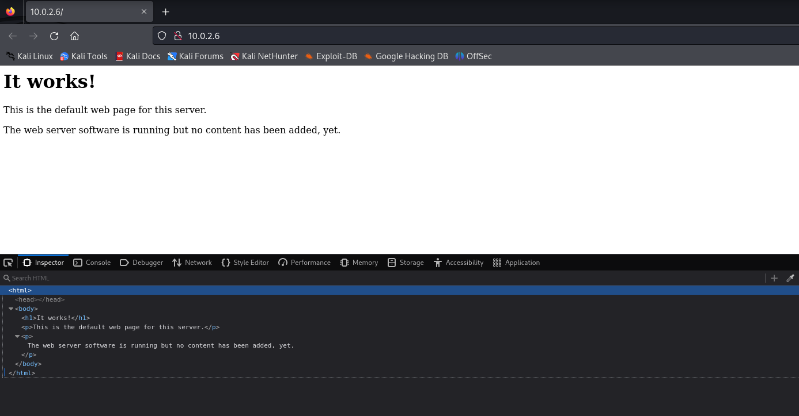

I use my usual nmap command to see which ports are open and their associated services. Consequently, the ports 21, 22 and 80 are open.

Moreover, I decide to use dirb to see if there are any pages on this website. I find access to a URL that links to a WordPress module recognisable by the initials "wp". This module can be found at the following address: http://10.0.2.6/secret .

I'm going to explore the page on which the wordpress module seems to be installed. The first thing I notice is that the display seems to be wrong.

As I learned in the last tutorial, I'm going into the source code to find out which version of wordpress is installed. 

I'm trying to go through the links on this page and I realise that they're inaccessible because the url is changing. 

I try to replace the new vtcsec word with the ip I was using to access the website and it works, I access a page. Problem is, the display is still wrong and I can't set the links manually every time. Therefore, I decided to look for a solution.

-> https://www.baeldung.com/linux/add-ip-hostname-file

On the link above, I've found a way of associating an ip with a hostname. I follow the tutorial and find myself in the /etc/hosts file, where I add the ip and hostname.

However, the file is in readonly so I have to open it with sudo and repeat the operation.

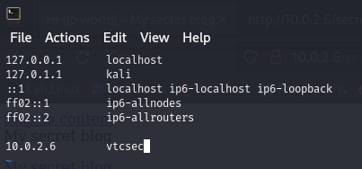

I go back to the website and I see that it worked, my page is displayed normally and the links are no longer broken.

I'm trying to go through the various pages discovered with dirb but I realise that I don't have access to many pages and I can't find anything that has been left visible.

So I decided to go back online and research any vulnerabilities that might exist in the version of wordpress that I'd found.

-> https://wpscan.com/wordpress/4920/

I came across a website that documents vulnerabilities in wordpress and this website offers a tool for detecting them: WPScan.

-> https://www.kali.org/tools/wpscan/

Looking for more information about this tool, I came across the official page on the kali website. Therefore, I decided to use it in the same way as it is presented on the website.

After this initial scan, I don't really know how to exploit this data. Thus, I try other parameters until I come across the "u" which refers to a user who would be admin.

I'm also adding an API token because I don't want to get the error telling me that I haven't added one.

Now, exploring the parameters that can be added to the wpscan command on the kali website, I realise that there are functions that can be used to bruteforce passwords from wordlists. So I'm looking for one on the internet and I find a GitHub repository that lists several password lists. So I decided to download one and use it on the admin user.

Perfect, the admin password is admin thus I'm doing a dirb again because I'm looking for the link to connect to the wordpress admin interface.

I go to this login page, I enter the username: admin then the password: admin and it works, I am logged in!

Now, I have the admin access to the WordPress website.

While looking for vulnerabilities that I could access via the Wordpress admin interface, I came across this vulnerability: https://www.hackingarticles.in/wordpress-reverse-shell/ . It consists of injecting a php shell into an existing page. This technique only works if you have the admin login and password, which I managed to get before!

I'm looking for a reverse shell to install so that I can inject it into the website. However, while searching I came across a tool that kali linux already has called webshells. So this optimises my task and I don't need to download it, it's already present on my kali machine.

Thus, I'm going to copy this shell and paste it onto a page in my wordpress theme. I've chosen to copy it to the Header theme page because, in my opinion, as it is the parent of many pages, it should offer more access.

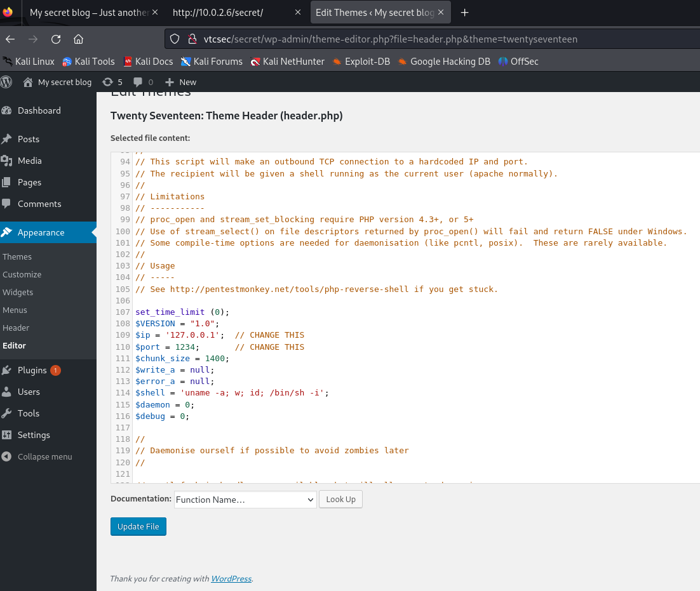

Now I need to change the ip and port. At first I make a mistake, I put the ip and port of the machine under attack, then I try to put a random port, thinking that the error was coming from here. Moreover, I change the ip to the ip of my machine, the machine carrying out the attack. While staying on the port I'd set randomly, it works, I manage to connect with netcat!

To connect using netcat, I send my netcat command with the specified options:
-l : listen mode, for inbound connects
-v : verbose
-p : port number

Once my command has been sent, nothing happens until I refresh the page: http://10.0.2.6/secret .

I'm still not logged in as root but I have more access because I'm going back to the same place I went to in the first place using the guest user. At that point, in marlinspike, I see a password that seems to be hashed! 

As a result, I'm looking for a solution to remove the hash from this password and while searching I came across **john**. It's a kali linux tool that can help system administrators find weak passwords, and even automatically send a message to users to warn them, if desired.

-> https://www.kali.org/tools/john/

I test several ways of using it, at first it doesn't work, then I find the right command because -single uses "Single crack" mode, using default.

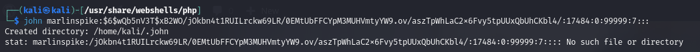

It works, I find the password which is simply equal to the user name: marlinspike.

I connect to this user using ssh, enter the password and manage to connect. However, I'm not root yet. So I redo sudo -l to see what I can do with this user and I see that he can have root rights. I searched on the internet for the command to become root myself and came across : "sudo bash". I finally have root rights!

## C. Tools Discovered

* wpscan : https://www.kali.org/tools/wpscan/
* webshells : https://www.kali.org/tools/webshells/
* john : https://www.kali.org/tools/john/

 
 
 

# IV. **TP4** : PENTESTER LAB: FROM SQL INJECTION TO SHELL

### Link : https://www.vulnhub.com/entry/pentester-lab-from-sql-injection-to-shell,80/

## A. Overview

Welcome to TP4 of our ethical hacking series, "PENTESTER LAB: FROM SQL INJECTION TO SHELL." In this session, my objective is to guide you through a practical experience that will unveil the intricacies of ethical hacking, starting with SQL injection and culminating in gaining access to the administration console. 

## B. Methodology

I've installed the image I'm going to use and I see that it's a debian virtual machine. Given that I have access to a command prompt, my first instinct is to run an ifconfig to retrieve the ip of this machine : **10.0.2.7**.

I decide to do an aggressive nmap to find out which ports are open and which services are in use. There are only ports 22 and 80. I can see that on port 80 there's an http sserice and an apache server and therefore a website.

I visit this website, which is a photoblog. I can see straight away that there's an admin tab, so there's probably an Admin interface that I'll have to use. Then I look at the page's source code to see if there are any vulnerabilities lurking there. I can see straight away that the links are GET links, as for example on "**cat.php?id=1**". 

While browsing the pages I came across a message that seemed strange to me: "Notice : Undefined index: order in /var/www/all.php".

There seems to be a problem with the indexes, as some pages contain two images, others one and others zero.

Once I've explored the website manually, I decide to do a dirb to see if I've missed any pages.

Given that the theme of this exercise is SQL injections. I remember that during my years at the IUT in the web development course we had several security lessons on GET links, so I'm thinking that there might be a mistake in the way you retrieve pages from the identifiers in the url.

As a result, I try to modify the identifier and I see that there is a "WHERE CLAUSE" error. So I immediately imagine that the way to retrieve the image is as follows: "SELECT image FROM table WHERE id=This is retrieved from the URL".

So I'm trying to enter queries directly in the link but I realise that it doesn't work because to add another query and have the result return the result of the two queries combined, you need a "UNION".

However, I can't display anything but I'm thinking that there might be a vulnerability to exploit, so I decide to search the internet to see if kali linux has a tool to exploit this vulnerability.

That's when I came across a site showing how to use the tools for SQL injection. I also see that once again the official kali site presents a tool, the "sqlmap" tool.

-> https://linuxhint.com/sql-injection-kali-linux/

First I test this link but I can't use the sqliv tool, but when I ask chatGPT why, I realise that I don't need to use it and that I can just use sqlmap. The goal for this tool is to detect and take advantage of SQL injection vulnerabilities in web applications.

Thus, I'm using sqlmap with the -u option to define the url. The result shows that there was a GET Parameter error, as I had noticed.

I then add the problematic link to my sqlmap command and, as I saw in the tutorial link that used sqliv, I add the "--dbs" option to extract the database names.

I finally got the names of the two databases : 
- information_schema
- photoblog

Now I can add the -D option which allows me to specify the database I want to see and the --tables option which allows me to see the tables that make it up.

I see that the USER_PRIVILEGES table seems interesting for my purpose, which is to be an admin. So I look at his columns.

Then I realised that the columns option wasn't that interesting for me because the --dump option allows you to see both the columns and the data in them.

Finding nothing of interest, I decided to explore the other database, called "photoblog".

I see a users table, which could be interesting if passwords are stored there.
When I want to display the table I'm asked to add a dictionary, so I choose the one I used during the last tp.

Sqlmap can't find the right password using my dictionary, but I can still recover the hashed password.

So I'm thinking of using john again and so I'm redoing a file containing username:password.

This time I must specify the format. I'm trying to add my dictionary but it's not working. Consequently, I ask chatgpt what this format might be.

I tried again with my dictionary and the format but it didn't work. Finally, I understand that the problem is with my dictionary, which doesn't have enough words. So I go back to the github where the dictionary I was using is, and use the one that's more complete. I use the john tool again with the right dictionary and the right format and that's it I find the password which is **P4ssw0rd**.

I go back to the connection link on the site's admin page, fill in admin and P4ssw0rd and I manage to connect as admin to the website.

On this page I see that you can add files to the project directory. Therefore, I'm thinking again of the last tp and my use of the php reverse shell.

I retrieve the php-reverse-shell.php file from /usr/share/webshells/php. I modify it using mousepad, I put my ip and a port that I choose to set to 500 as I did for the last tp.

Once I've loaded it, I get an error: there must be a condition that filters files with the ".php" extension. I say to myself that if the code is wrong and the creator has forgotten to specify capital letters for the ".php" extension too. Then ".PHP" might work, so I rename my file.

I upload it again and it works, the file is on the website.

To conclude, I do my netcat and go to the new page, I refresh. And the connection is intercepted, I'm now connected to the site and I have **"www-data"** rights.

## C. Tools Discovered

* sqlmap : https://www.kali.org/tools/sqlmap/

 
 
 

# V. **TP5** : FUNBOX: CTF

### Link : https://www.vulnhub.com/entry/funbox-ctf,546/

## A. Overview

Let's dive into the TP5 – FUNBOX: CTF, titled "Groundhog Day: Boot2Root!" In this session, we're presented with an engaging and approachable scenario.

Once I breach the gates of Funbox: CTF, my mission is clear: discover, comprehend, and act upon the two conveniently placed hints. However, the path to success requires more than just a linear approach.

The ultimate objective is a threefold conquest – webadmin, gaining access, and achieving root. To unravel the mystery of FUNBOX: CTF, employ a skillful combination of reconnaissance, brute force, exploit mastery, and a keen understanding of web vulnerabilities. This session is not just about the destination; it's a journey that underscores the importance of meticulous exploration, emphasizing the essence of ethical hacking.

## B. Methodology

First of all, when I launched the ctf virtual machine I realised that it was an ubuntu machine and it required a password to connect to it.

I start by finding out the IP of this machine so that I can work on it.

Perfect, I found it using netdiscover, it's 10.0.2.5. 

*For information, this IP has already been used in this report but in the meantime I've changed the machine that hosts my virtual machines so that's why this IP is being used again.*

So I decide to look at which ports are open with which services using nmap. I do an aggressive search to get more information about these different services.

Since there's an Apache server on port 80, I'll do a dirb on the http://10.0.2.5 ip to see what routes I can find there.

I can't find anything interesting but I know I have to be a webadmin because that's one of the aims of this ctf. Consequently I'm persisting, I know there must be access to some files.

 

-> https://blog.sec-it.fr/en/2021/02/16/fuzz-dir-tools/

While looking for other ways to find pages, I came across all these tools for finding routes on a website. I tested a few of these tools, which gave me the same result as dirb. Some are not available, such as dirsearch.

Then I tried a lot of things and I still think about that robots.txt file that was on almost every website and I decided to test different spellings with, for example, the extension in upper case, the word in upper case and then the whole word and extension in upper case. At that point it worked and I came across a page showing two paths: **upload/** and **igmseklhgmrjmtherij2145236**.

I go to these two access points but I don't have permission to see what these folders contain.

I'm doing another dirb on these two new routes. All I find is a new upload folder that I still don't have access to.

So I'm trying other techniques that I find on the internet, such as searching with new wordlists with more words.

-> https://www.kali.org/tools/dirb/

Looking through the dirb documentation, I found the -X parameter which allows you to impose search extensions, so I'm trying it out by putting the extensions I think are the most common on websites.
So I find two new files, **"upload.php"** and **"upload.html"**.

These two pages allow you to upload files. This reminds me of my php-reverse-shell that I've already used.

I'm filing it and looking to see if it's recognised by dirb to see in which folder it may have been placed.

I can't find it anywhere and I realise that dirb uses a wordlist but "php-reverse-shell" is quite a long and complicated name so it must not be included in the wordlist. That's why I'm trying to rename my file to "test" which is a very common name.

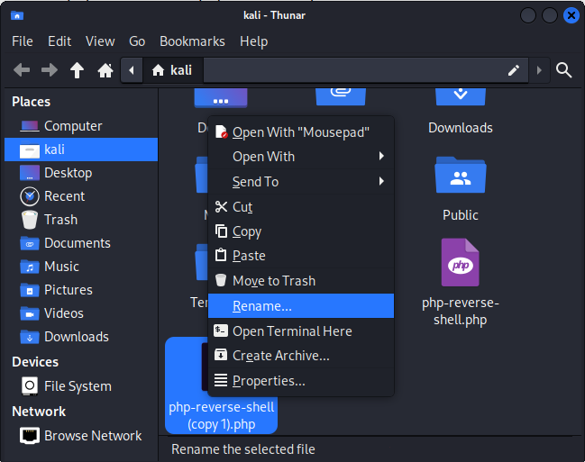

Finally, I found it in the upload folder.

As I learnt during the last practical sessions, I connect using netcatet and it works: I'm connected.

When I looked at the files in this directory, I came across a file called hint.txt.

I didn't understand what was included in this file so I decided to explore the other folders but I didn't come across anything interesting or that could help me decipher the hint.txt file.

Innocently, I do a search with the first thing to decipher. I understand that the language is the "Brainfuck language" and that there are sites that allow you to decode it, so I go to the first one.

-> https://www.dcode.fr/brainfuck-language

The translation is "the next hint is located in:". As a result, I understand that I need to decipher the other texts.

I ask chatGPT if it could tell me the language used to create these two encrypted messages. Consequently, I know that the first is written in **base64** and that the second is written in **base32**.

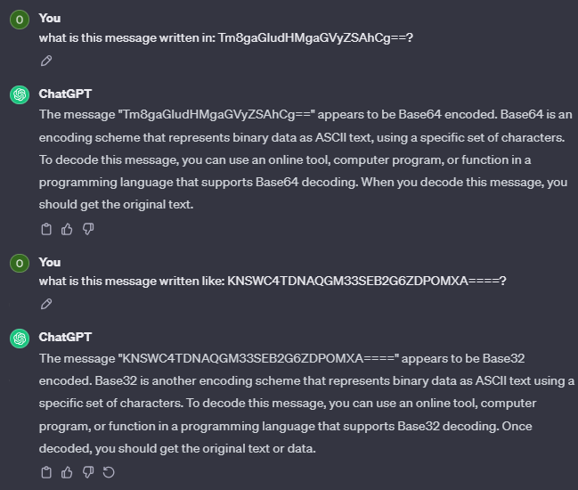

Looking for a way to decipher these two languages, I came across this website which explained how to do it. 

-> https://www.serverlab.ca/tutorials/linux/administration-linux/how-to-base64-encode-and-decode-from-command-line/

I discovered that he should have the rest of the riddle in a "todos" file.

I'm looking for a way to search for the path of files by name. I find this one and run it, but I can't find any "todos" files.

I'm trying to find it myself by looking through the folders that can be modified, but I can't find anything that looks like a todo.

I've found a way to check whether "todos" is included in a file name, but I still can't find anything.

As a result, I'm looking to remove letters : the most logical is the "s" at the end. I carry out a new search and come across a file that I hadn't discovered before, a ".todo".

I opened it but it didn't give me anything useful. So I looked at the other files called todo but I couldn't find anything useful either, so I decided it was a false lead.

So I'm looking for tutorials on how to become root on a Linux machine and I've come across these. 

-> https://www.youtube.com/watch?v=PE1A1j_xKUE

-> https://null-byte.wonderhowto.com/how-to/find-exploits-get-root-with-linux-exploit-suggester-0206005/

I follow them and start by using wget to retrieve a file that detects the exploits available depending on the linux version.

Following the tutorial to the letter, I came across the wrong call sign. So I understand that this is when I have to adapt it to my situation.

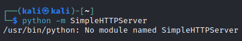

-> https://appdividend.com/2023/03/20/modulenotfounderror-no-module-named-simplehttpserver/

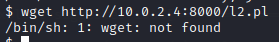

I decided to manually upload this exploit using the only access I had to the machine under attack.

I'm trying to recover my file that I installed on the machine. I can't move it even though I've given it full rights. So I look for a folder I can use and there I find dev/shm/, so I deplace my file into it and run it. That's when I found three exploits available for this version of Linux.

I'm trying to use each of these exploits.

-> https://www.exploit-db.com/exploits/45697

I can't launch the first one because I don't have Xorg on the machine being attacked.

-> https://www.exploit-db.com/exploits/40871

I'm going to test directly whether I have the tools to run this exploit. I look to see if I have gcc, I can't find it so I look to see if there is gcc on my system using the command I found earlier. I find a gcc-5 and a gcc-6, I test the gcc-6 it doesn't work but I also try gcc-5 and it works !

I retrieve the exploit with wget. But I get the wrong url because I even get the website code, so I go back, display only the script, get the url and redo the wget.

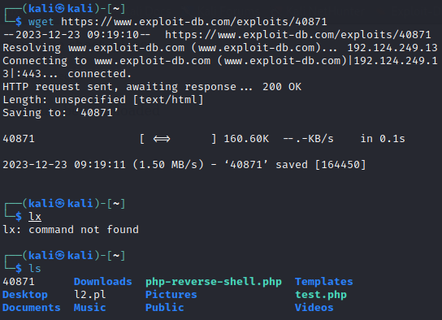

I rename this file to "exploit.c" and upload it again to the attacked machine.

I move it to my usable folder and decide to run it. I come across an error, I put it on chatgpt and it tells me how to correct it. I run the exploit again but it doesn't work, the route is not found despite several attempts.

-> https://www.exploit-db.com/exploits/45010

Now I'm doing the same for the last exploit.

I run it but it doesn't work, so I think maybe the file doesn't have enough rights.

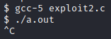

So I'm thinking maybe it was the same for the last exploit, so I'm adding the rights to it. I try again but it still doesn't work.

I'm doing the same thing for the exploit I'm trying but it still doesn't work. I don't understand it until I get to the td that shows metasploit.

-> https://tryhackme.com/room/metasploitintro

So I decide to use this tool with the help of chatgpt.

I can't do what I want with reverse_tcp so I've decided to switch to multi/handler. I launch it and connect to the shell. 

I log in and decide to try to restart my exploit and it works, I finally become **root**.

Given that the name of the tp is "CTF" I'm thinking that there might be a flag to recover, so I'm looking for it with the command I've learnt. I find a file called "flag.txt", I open it, and I discover that I've succeeded in capturing the flag.

## C. Tools Discovered

* https://man7.org/linux/man-pages/man1/find.1.html
* https://raw.githubusercontent.com/jondonas/linux-exploit-suggester-2/master/linux-exploit-suggester-2.pl
* https://www.kali.org/tools/metasploit-framework/

 
 
 

# VI. Conclusion

## A. Lessons Learned

In conclusion, the practical sessions proved to be an interesting way of broadening my understanding of cyber security. Not only did the hands-on experience allow me to familiarise myself with a varied set of tools, but it also gave me an in-depth knowledge of effective strategies for securing systems. 

If I were to return to these sessions, I would use tools earlier in my research process. For example, I would prioritise the integration of Metasploit earlier in the process. Its powerful penetration and exploitation testing capabilities would have allowed me to find some potential vulnerabilities earlier.

All the same, I'm proud of the fact that I managed to achieve all the objectives I was given.

## B. Bibliography

1. **dCode.fr**. (n.d.). *Brainfuck Language - Online Decoder, Translator, Interpreter*. Retrieved from [https://www.dcode.fr/brainfuck-language](https://www.dcode.fr/brainfuck-language)

2. **OpenAI**. (n.d.). *ChatGPT*. Retrieved from [https://chat.openai.com](https://chat.openai.com)

3. Fantastic, H. (2018, October 25). *Xorg-X11-Server < 1.20.3 - Local Privilege Escalation*. Exploit Database. [https://www.exploit-db.com/exploits/45697](https://www.exploit-db.com/exploits/45697)

4. Find Exploits & Get Root with Linux Exploit Suggester [Tutorial]. (2020). [https://www.youtube.com/watch?v=PE1A1j_xKUE](https://www.youtube.com/watch?v=PE1A1j_xKUE)

5. **SQLPac**. (n.d.). *FTP En Ligne de Commandes*. Retrieved from [https://www.sqlpac.com/fr/documents/unix-ftp-commandes.html](https://www.sqlpac.com/fr/documents/unix-ftp-commandes.html)

6. **Danielmiessler/SecLists**. (n.d.). *SecLists/Passwords/Common-Credentials/10-Million-Password-List-Top-1000000.Txt*. GitHub. [https://github.com/danielmiessler/SecLists/blob/master/Passwords/Common-Credentials/10-million-password-list-top-1000000.txt](https://github.com/danielmiessler/SecLists/blob/master/Passwords/Common-Credentials/10-million-password-list-top-1000000.txt)

7. MalCare. (2023, April 5). *How to Use WPScan: A Step-by-Step Tutorial*. [https://www.malcare.com/blog/how-to-use-wpscan/](https://www.malcare.com/blog/how-to-use-wpscan/)

8. **IBM**. (2023, March 24). *Documentation*. Retrieved from [https://www.ibm.com/docs/fr/aix/7.3?topic=files-etcpasswd-file](https://www.ibm.com/docs/fr/aix/7.3?topic=files-etcpasswd-file)

9. **IONOS Digital Guide**. (2020, October 2). *Qu’est-ce que Netcat ?*. Retrieved from [https://www.ionos.fr/digitalguide/serveur/outils/netcat/](https://www.ionos.fr/digitalguide/serveur/outils/netcat/)

10. GTFOBins. (n.d.). *Journalctl*. Retrieved from [https://gtfobins.github.io/gtfobins/journalctl/](https://gtfobins.github.io/gtfobins/journalctl/)

11. **Kali Linux**. (n.d.). *Dirb | Kali Linux Tools*. Retrieved from [https://www.kali.org/tools/dirb/](https://www.kali.org/tools/dirb/)

12. **Kali Linux**. (n.d.). *John | Kali Linux Tools*. Retrieved from [https://www.kali.org/tools/john/](https://www.kali.org/tools/john/)

13. **Kali Linux**. (n.d.). *Maskprocessor | Kali Linux Tools*. Retrieved from [https://www.kali.org/tools/maskprocessor/](https://www.kali.org/tools/maskprocessor/)

14. **Kali Linux**. (n.d.). *Wpscan | Kali Linux Tools*. Retrieved from [https://www.kali.org/tools/wpscan/](https://www.kali.org/tools/wpscan/)

15. Kazeem, A. (2023, March 15). *How to Add an IP to a Hostname File*. Baeldung on Linux. [https://www.baeldung.com/linux/add-ip-hostname-file](https://www.baeldung.com/linux/add-ip-hostname-file)

16. Krunal. (2023, March 19). *How to Fix ModuleNotFoundError: No Module Named “SimpleHTTPServer”*. AppDividend. [https://appdividend.com/2023/03/20/modulenotfounderror-no-module-named-simplehttpserver/](https://appdividend.com/2023/03/20/modulenotfounderror-no-module-named-simplehttpserver/)

17. **Danielmiessler**. (2023). *SecLists*. PHP. [https://github.com/danielmiessler/SecLists](https://github.com/danielmiessler/SecLists)

18. More - Filtre Lecteur de Fichier. (n.d.). [https://www.man-linux-magique.net/man1/more.html](https://www.man-linux-magique.net/man1/more.html)

19. Rainville, S. (2020, September 1). *How to Base64 Encode and Decode from Command-Line*. Serverlab. [https://www.serverlab.ca/tutorials/linux/administration-linux/how-to-base64-encode-and-decode-from-command-line/](https://www.serverlab.ca/tutorials/linux/administration-linux/how-to-base64-encode-and-decode-from-command-line/)

20. Ramadhan, B. F. (n.d.). *SQL Injection with Kali Linux*. Retrieved from [https://linuxhint.com/sql-injection-kali-linux/](https://linuxhint.com/sql-injection-kali-linux/)

21. rebel. (2016, December 6). *Linux Kernel 4.4.0 (Ubuntu 14.04/16.04 X86-64) - “AF_PACKET” Race Condition Privilege Escalation*. Exploit Database. [https://www.exploit-db.com/exploits/40871](https://www.exploit-db.com/exploits/40871)

22. **Nmap**. (n.d.). *Résumé Des Options | Guide de Référence Nmap (Man Page, French Translation)*. Retrieved from [https://nmap.org/man/fr/man-briefoptions.html](https://nmap.org/man/fr/man-briefoptions.html)

23. rlarabee. (2018, July 10). *Linux Kernel < 4.13.9 (Ubuntu 16.04 / Fedora 27) - Local Privilege Escalation*. Exploit Database. [https://www.exploit-db.com/exploits/45010](https://www.exploit-db.com/exploits/45010)

24. SEC-IT Team. (2021, February 16). *Web Content Enumeration Tools in 2021*. SEC-IT Blog. [https://blog.sec-it.fr/en/2021/02/16/fuzz-dir-tools/index.html](https://blog.sec-it.fr/en/2021/02/16/fuzz-dir-tools/index.html)

25. **TryHackMe**. (n.d.). *TryHackMe | Metasploit: Introduction*. Retrieved from [https://tryhackme.com/room/metasploitintro](https://tryhackme.com/room/metasploitintro)

26. WonderHowTo. (2020, February 19). *How to Find Exploits & Get Root with Linux Exploit Suggester*. [https://null-byte.wonderhowto.com/how-to/find-exploits-get-root-with-linux-exploit-suggester-0206005/](https://null-byte.wonderhowto.com/how-to/find-exploits-get-root-with-linux-exploit-suggester-0206005/)

27. **WPScan**. (n.d.). *WordPress 4.9.20 Vulnerabilities*. Retrieved from [https://wpscan.com/wordpress/4920](https://wpscan.com/wordpress/4920)
